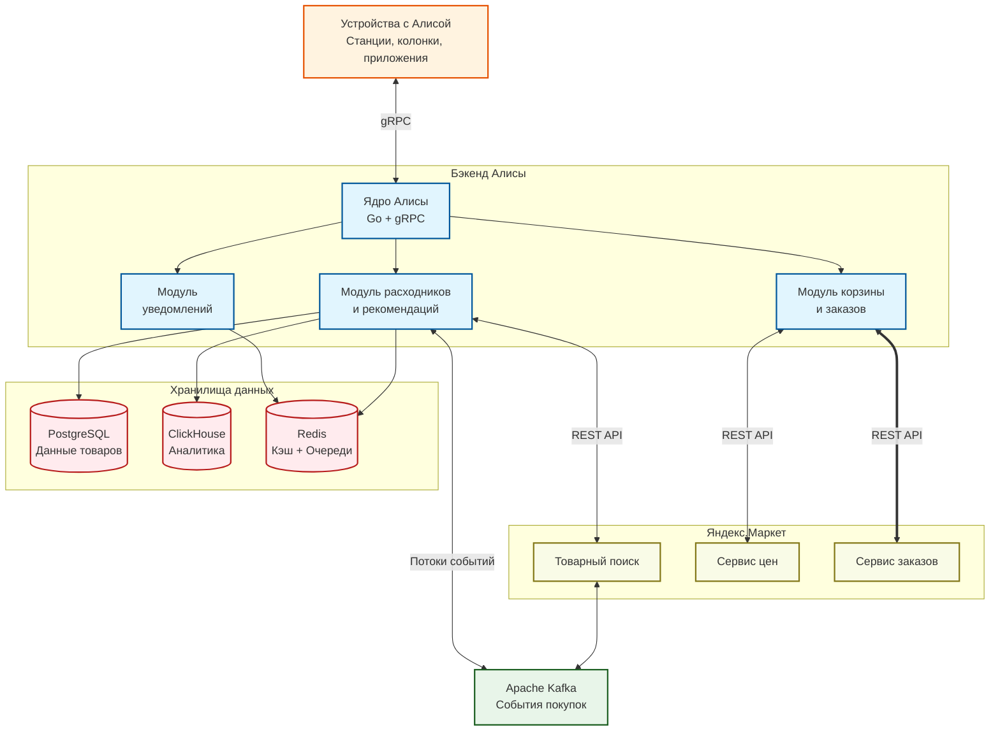
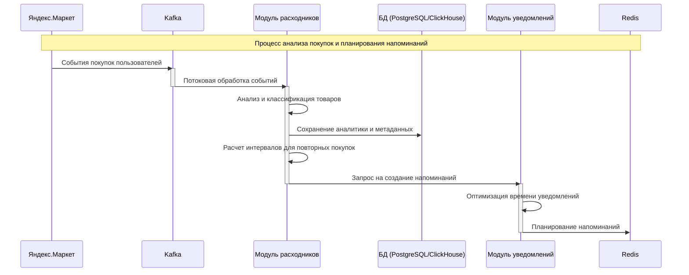
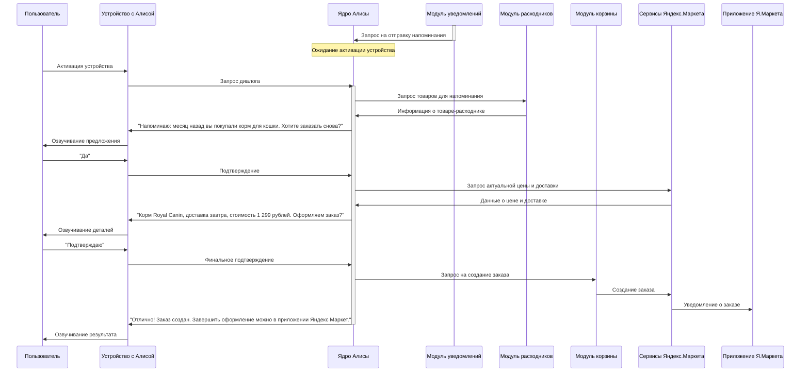

# Архитектура интеграции Алисы в Яндекс Маркет
## Функционал "Повторная покупка расходников через Алису"

## 1. Описание решения

Архитектура реализует функционал повторной покупки расходников через голосового помощника Алису на устройствах Яндекса. Основной сценарий: Алиса напоминает о товарах-расходниках, которые пользователь покупал ранее в Яндекс Маркете, и предлагает повторить заказ голосовым подтверждением.

## 2. Архитектура решения

## 3. Компоненты системы

### 3.1 Ядро Алисы
- **Назначение**: Обработка голосовых команд, распознавание намерений, маршрутизация запросов
- **Технологии**: 
  - Go для основного кода (низкая латентность, высокая производительность)
  - gRPC для внешнего API
  - Протобуф для сериализации данных
- **Особенности**: Единый вход для всех запросов от устройств с Алисой

### 3.2 Модуль расходников и рекомендаций
- **Назначение**: Определение товаров-расходников, расчет времени для повторной покупки
- **Технологии**:
  - ML-модели для классификации товаров
  - Интеграция с потоком событий покупок через Kafka
  - Предварительный расчет рекомендаций
- **Особенности**: Работает в фоновом режиме для подготовки данных

### 3.3 Модуль уведомлений
- **Назначение**: Планирование и управление уведомлениями для пользователей
- **Технологии**:
  - Планировщик на базе Redis для отложенных напоминаний
  - Алгоритмы оптимизации времени уведомлений
- **Особенности**: Интеллектуальное планирование для максимального отклика

### 3.4 Модуль корзины и заказов
- **Назначение**: Взаимодействие с сервисами Маркета для создания заказов
- **Технологии**:
  - Интеграция с API Яндекс.Маркета
  - Асинхронное создание заказов
- **Особенности**: Минимизация задержек при взаимодействии с внешними сервисами

## 4. Потоки данных

### 4.1 Определение расходников и планирование напоминаний

### 4.2 Процесс напоминания и заказа

## 5. Обеспечение нефункциональных требований

### 5.1 Производительность (лимит 300 мс)
- Монолитный подход с модульной структурой минимизирует сетевые задержки
- Предрасчет и кэширование данных для быстрого ответа
- Асинхронное выполнение долгих операций
- Использование высокопроизводительных языков (Go) для ядра
- Многоуровневое кэширование наиболее востребованных данных

### 5.2 Надежность
- Отказоустойчивое проектирование основных компонентов
- Деградация функциональности при недоступности внешних сервисов
- Механизмы повторных попыток и компенсирующих транзакций
- Circuit breaker для защиты от каскадных отказов
- Регулярное резервное копирование данных

### 5.3 Масштабируемость
- Горизонтальное масштабирование бэкенда Алисы
- Разделение задач реального времени и фоновой обработки
- Возможность независимого масштабирования модулей при необходимости

## 6. Используемые технологии и обоснование выбора

| Компонент | Технологии | Обоснование |
|-----------|------------|-------------|
| Ядро Алисы | Go | Низкая латентность, эффективное использование ресурсов, высокая производительность для обработки запросов в реальном времени |
| ML-компоненты | Python | Богатая экосистема библиотек ML/AI, удобство разработки и итерации моделей |
| Хранение данных | PostgreSQL, ClickHouse | PostgreSQL для транзакционных данных, ClickHouse для аналитических запросов и больших объемов данных |
| Межсервисное взаимодействие | gRPC, REST API | gRPC для внутренних высокопроизводительных вызовов, REST API для совместимости с существующими сервисами |
| Очереди и потоки | Kafka | Высокая производительность для обработки потоков событий, гарантии доставки |
| Кэширование | Redis | Низкая латентность, поддержка различных структур данных и паттернов (кэш, очереди, планировщик) |
| Мониторинг | Prometheus, Grafana | Комплексное наблюдение за системой, визуализация метрик, алертинг |
| Деплой | Kubernetes | Управление контейнерами, оркестрация, масштабирование | 