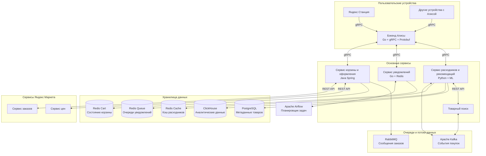
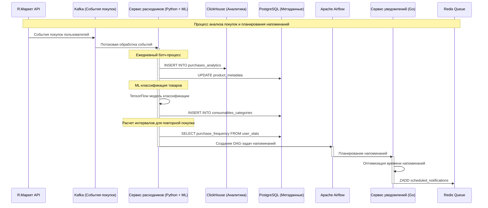
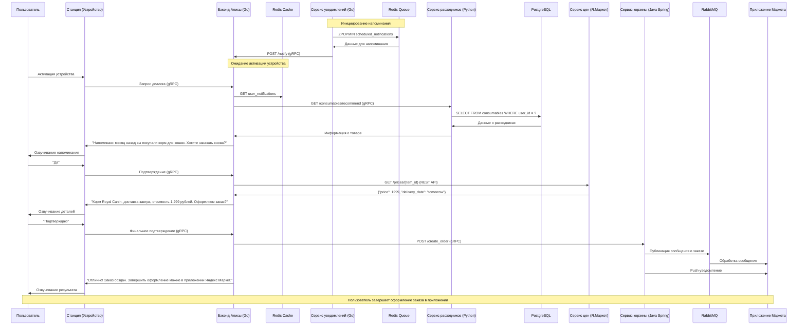

# Архитектура интеграции Алисы в Яндекс Маркет
## Функционал "Повторная покупка расходников через Алису"

## 1. Описание решения

Архитектура реализует функционал повторной покупки расходников через голосового помощника Алису на устройствах Яндекса. Основной сценарий: Алиса напоминает о товарах-расходниках, которые пользователь покупал ранее в Яндекс Маркете, и предлагает повторить заказ голосовым подтверждением.

## 2. Архитектура решения

## 3. Компоненты системы

### 3.1 Бэкенд Алисы
- **Назначение**: Обработка голосовых команд, распознавание намерений, формирование ответов
- **Технологии**: 
  - gRPC для межсервисных коммуникаций
  - Протобуф для сериализации данных
  - Go для обработки запросов (высокая производительность, низкая латентность)
- **Особенности**: Кэширование часто используемых данных в Redis для соблюдения лимита в 300 мс

### 3.2 Сервис расходников и рекомендаций
- **Назначение**: Определение товаров-расходников, расчет времени для повторной покупки
- **Технологии**:
  - Python + ML-модели для классификации товаров как расходников
  - Apache Kafka для потоковой обработки данных о покупках
  - ClickHouse для аналитического хранилища
  - PostgreSQL для хранения метаданных
- **Особенности**: Предрасчет рекомендаций в отложенном режиме, чтобы не задерживать ответ Алисы

### 3.3 Сервис уведомлений
- **Назначение**: Планирование и триггеринг уведомлений для пользователей
- **Технологии**:
  - Go для основного сервиса (эффективность и скорость)
  - Redis для очередей и отложенных задач
  - Apache Airflow для планирования напоминаний
- **Особенности**: Балансировка нагрузки между разными временными слотами для равномерного распределения напоминаний

### 3.4 Сервис корзины и оформления
- **Назначение**: Создание заказов в корзине и отправка уведомлений в приложение Маркета
- **Технологии**:
  - Java (Spring Boot) для совместимости с экосистемой Маркета
  - RabbitMQ для надежной доставки сообщений
  - Redis для кэширования состояния корзины
- **Особенности**: Асинхронная обработка для снижения задержек

### 3.5 Интеграция с сервисами Яндекс Маркета
- **Товарный поиск**: Интеграция через API с кэшированием популярных запросов
- **Сервис цен**: Предзагрузка актуальных цен для потенциальных расходников
- **Сервис заказов**: Асинхронное создание заказов через очереди сообщений

## 4. Потоки данных

### 4.1 Определение расходников и планирование напоминаний

### 4.2 Процесс напоминания и заказа

## 5. Обеспечение нефункциональных требований

### 5.1 Производительность (лимит 300 мс)
- Предрасчет и кэширование данных для быстрого ответа
- Асинхронное выполнение долгих операций
- Использование высокопроизводительных языков (Go) для критичных компонентов
- Горизонтальное масштабирование сервисов под нагрузкой
- Многоуровневое кэширование (Redis + локальные кэши)

### 5.2 Надежность
- Отказоустойчивое проектирование всех компонентов (минимум N+1 реплик)
- Сервисы с состоянием дублируются в разных дата-центрах
- Очереди сообщений гарантируют доставку событий даже при сбоях
- Circuit breaker для предотвращения каскадных отказов
- Стратегия деградации: даже при проблемах с рекомендациями основной функционал Алисы работает

### 5.3 Масштабируемость
- Микросервисная архитектура для независимого масштабирования компонентов
- Stateless-дизайн для горизонтального масштабирования
- Шардирование данных для равномерного распределения нагрузки

## 6. Используемые технологии и обоснование выбора

| Компонент | Технологии | Обоснование |
|-----------|------------|-------------|
| Основные сервисы | Go | Низкая латентность, эффективное использование ресурсов, отличная параллельная обработка |
| ML-компоненты | Python | Богатая экосистема библиотек ML/AI (TensorFlow, PyTorch, scikit-learn) |
| Хранение данных | PostgreSQL, ClickHouse | PostgreSQL для ACID-транзакций, ClickHouse для аналитики и большого объема данных |
| Межсервисное взаимодействие | gRPC, Protobuf | Высокая производительность, строгая типизация, компактный формат |
| Очереди и потоки | Kafka, RabbitMQ | Kafka для высоконагруженных потоков, RabbitMQ для надежной доставки сообщений |
| Кэширование | Redis | Низкая латентность, атомарные операции, поддержка различных структур данных |
| Мониторинг | Prometheus, Grafana | Стандарт индустрии, высокая масштабируемость, богатая визуализация |
| CI/CD | GitLab CI, Kubernetes | Автоматизация развертывания, управление контейнерами, горизонтальное масштабирование | 