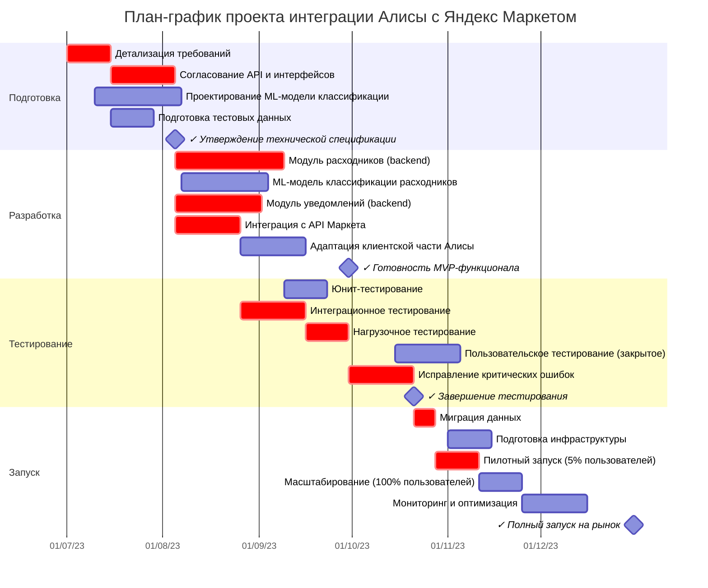

# План-график проекта "Интеграция Алисы с Яндекс Маркетом"
## Функционал "Повторная покупка расходников через Алису"

## Диаграмма Ганта

## RACI-матрица ответственности

| Активность/Артефакт | Команда Алисы (PM) | Команда Алисы (Разработка) | Команда Алисы (ML) | Команда Маркета (API) | Команда Маркета (Данные) | UX/UI Дизайн | QA | DevOps |
|---------------------|--------------------|-----------------------------|--------------------|-----------------------|--------------------------|--------------|----|----|
| Техническая спецификация | A/R | C | C | C | C | I | I | I |
| API-интерфейсы | C | R | I | A/R | C | I | I | I |
| ML-модель классификации | I | C | A/R | I | C | I | I | I |
| Модуль расходников | C | A/R | C | C | I | I | I | I |
| Модуль уведомлений | C | A/R | I | I | I | C | I | I |
| Интеграция с Маркетом | C | A/R | I | C | R | I | I | I |
| Клиентская часть | C | A/R | I | I | I | R | I | I |
| Тестовые сценарии | A | C | C | C | C | I | R | I |
| Нагрузочное тестирование | C | C | I | I | I | I | R | A |
| Пилотный запуск | A/R | C | C | C | C | I | C | R |
| Полный запуск | A | C | C | C | C | I | C | R |

*R - Responsible (Исполнитель), A - Accountable (Ответственный), C - Consulted (Консультант), I - Informed (Информируемый)*

## Команды и их роли

### Команда Алисы
- **Проектная команда**: координация, планирование, контроль сроков (РМ, аналитики)
- **Команда разработки бэкенда**: ядро Алисы, модули интеграции (инженеры Go)
- **Команда ML**: модель классификации расходников (Data Scientists, ML-инженеры)
- **Команда фронтенда**: адаптация клиентской части (инженеры голосового интерфейса)

### Команда Маркета
- **Команда API**: предоставление и поддержка API, адаптация интерфейсов
- **Команда данных**: подготовка выборок, доступ к истории покупок, метаданным товаров

### Общие ресурсы
- **UX/UI Дизайн**: проектирование голосовых сценариев, UX-тестирование
- **QA**: тестирование интеграции, сценарии, автоматизация тестов
- **DevOps**: инфраструктура, CI/CD, масштабирование, мониторинг

## Предположения и ограничения

### Предположения
1. Команды Алисы и Маркета могут выделить необходимые ресурсы согласно плану
2. API Маркета стабильно и поддерживает все необходимые методы
3. Исторические данные о покупках доступны в необходимом объеме для обучения ML-модели
4. Существующая инфраструктура Алисы позволяет масштабировать решение

### Ограничения
1. **Время**: жесткий дедлайн в 6 месяцев связан с внешними событиями
2. **Производительность**: время ответа не должно превышать 300 мс
3. **Доступность данных**: соблюдение требований безопасности и конфиденциальности
4. **Зрелость технологий**: использование только проверенных технологий из стека Яндекса

## Матрица рисков

| Риск | Вероятность (1-5) | Влияние (1-5) | Оценка (P×I) | Стратегия снижения |
|------|-------------------|---------------|--------------|-------------------|
| Задержки в согласовании API интерфейсов | 4 | 5 | 20 | Раннее вовлечение представителей Маркета, еженедельные синхронизации |
| Недостаточная точность ML-модели классификации | 3 | 5 | 15 | Дополнительные данные, A/B тестирование, возможность ручной классификации |
| Превышение времени ответа (>300 мс) | 3 | 5 | 15 | Нагрузочное тестирование с ранних этапов, оптимизация запросов, кэширование |
| Недостаточный объем данных для ML | 4 | 3 | 12 | Альтернативные источники данных, синтетические данные |
| Проблемы с доступностью API Маркета | 2 | 5 | 10 | Механизмы повторных попыток, кэширование, деградация функциональности |
| Сложности интеграции с существующей инфраструктурой | 3 | 3 | 9 | Ранние интеграционные тесты, выделенные ресурсы DevOps |
| Негативная реакция пользователей | 2 | 4 | 8 | Пилотное тестирование с фокус-группами, поэтапный запуск |
| Превышение выделенных вычислительных ресурсов | 2 | 3 | 6 | Ранняя оценка нагрузки, резервные мощности |

## Обоснование сроков критического пути

Критический путь выделен на диаграмме Ганта и включает следующие ключевые этапы:

1. **Детализация требований (2 недели)** - базируется на опыте предыдущих интеграций Алисы
2. **Согласование API и интерфейсов (3 недели)** - с учетом вовлечения двух команд и процесса утверждения
3. **Модуль расходников (5 недель)** - основной компонент интеграции, включает логику взаимодействия
4. **Интеграционное тестирование (3 недели)** - проверка взаимодействия всех компонентов
5. **Нагрузочное тестирование (2 недели)** - подтверждение производительности при высокой нагрузке
6. **Исправление критических ошибок (3 недели)** - буфер для устранения выявленных проблем
7. **Миграция данных (1 неделя)** - подготовка к запуску с актуальными данными
8. **Пилотный запуск (2 недели)** - постепенный запуск на ограниченную аудиторию

Общая продолжительность критического пути составляет **21 неделю**, что соответствует выделенным 6 месяцам при наличии небольшого резерва на непредвиденные обстоятельства. Сроки основаны на историческом опыте команды Алисы по аналогичным проектам, уточнены после консультаций с техническими экспертами и согласованы с представителями Маркета. 