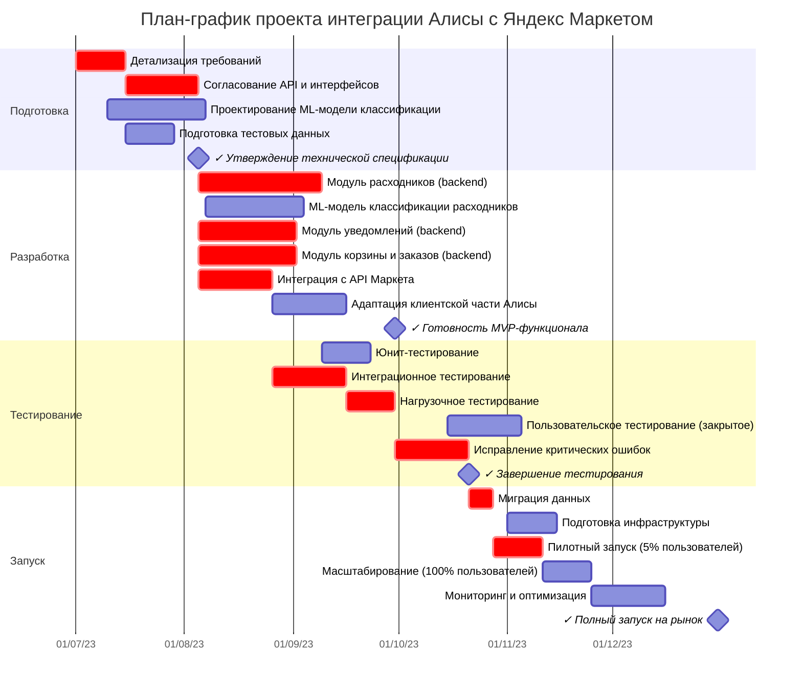

# План-график проекта "Интеграция Алисы с Яндекс Маркетом"
## Функционал "Повторная покупка расходников через Алису"

## Диаграмма Ганта

## RACI-матрица ответственности

| Активность/Артефакт | Команда Алисы (PM) | Команда Алисы (Разработка) | Команда Алисы (ML) | Команда Маркета (API) | Команда Маркета (Данные) | UX/UI Дизайн | QA | DevOps |
|---------------------|--------------------|-----------------------------|--------------------|-----------------------|--------------------------|--------------|----|----|
| Техническая спецификация | A/R | C | C | C | C | I | I | I |
| API-интерфейсы | C | R | I | A/R | C | I | I | I |
| ML-модель классификации | I | C | A/R | I | C | I | I | I |
| Модуль расходников | C | A/R | C | C | I | I | I | I |
| Модуль уведомлений | C | A/R | I | I | I | C | I | I |
| Модуль корзины и заказов | C | A/R | I | C | I | I | I | I |
| Интеграция с Маркетом | C | A/R | I | C | R | I | I | I |
| Клиентская часть | C | A/R | I | I | I | R | I | I |
| Тестовые сценарии | A | C | C | C | C | I | R | I |
| Нагрузочное тестирование | C | C | I | I | I | I | R | A |
| Пилотный запуск | A/R | C | C | C | C | I | C | R |
| Полный запуск | A | C | C | C | C | I | C | R |

*R - Responsible (Исполнитель), A - Accountable (Ответственный), C - Consulted (Консультант), I - Informed (Информируемый)*

## Команды и их роли

### Команда Алисы
- **Проектная команда**: координация, планирование, контроль сроков (РМ, аналитики)
- **Команда разработки бэкенда**: ядро Алисы, модули интеграции (инженеры Go)
- **Команда ML**: модель классификации расходников (Data Scientists, ML-инженеры)
- **Команда фронтенда**: адаптация клиентской части (инженеры голосового интерфейса)

### Команда Маркета
- **Команда API**: предоставление и поддержка API, адаптация интерфейсов
- **Команда данных**: подготовка выборок, доступ к истории покупок, метаданным товаров

### Общие ресурсы
- **UX/UI Дизайн**: проектирование голосовых сценариев, UX-тестирование
- **QA**: тестирование интеграции, сценарии, автоматизация тестов
- **DevOps**: инфраструктура, CI/CD, масштабирование, мониторинг

## Предположения и ограничения

### Предположения
1. Команды Алисы и Маркета могут выделить необходимые ресурсы согласно плану
2. API Маркета стабильно и поддерживает все необходимые методы
3. Исторические данные о покупках доступны в необходимом объеме для обучения ML-модели
4. Существующая инфраструктура Алисы позволяет масштабировать решение

### Ограничения
1. **Время**: жесткий дедлайн в 6 месяцев связан с внешними событиями
2. **Производительность**: время ответа не должно превышать 300 мс
3. **Доступность данных**: соблюдение требований безопасности и конфиденциальности
4. **Зрелость технологий**: использование только проверенных технологий из стека Яндекса

## Матрица рисков

| Риск | Вероятность (1-5) | Влияние (1-5) | Оценка (P×I) | Стратегия снижения |
|------|-------------------|---------------|--------------|-------------------|
| Задержки в согласовании API интерфейсов | 4 | 5 | 20 | Раннее вовлечение представителей Маркета, еженедельные синхронизации |
| Недостаточная точность ML-модели классификации | 3 | 5 | 15 | Дополнительные данные, A/B тестирование, возможность ручной классификации |
| Превышение времени ответа (>300 мс) | 3 | 5 | 15 | Нагрузочное тестирование с ранних этапов, оптимизация запросов, кэширование |
| Недостаточный объем данных для ML | 4 | 3 | 12 | Альтернативные источники данных, синтетические данные |
| Проблемы с доступностью API Маркета | 2 | 5 | 10 | Механизмы повторных попыток, кэширование, деградация функциональности |
| Сложности интеграции с существующей инфраструктурой | 3 | 3 | 9 | Ранние интеграционные тесты, выделенные ресурсы DevOps |
| Негативная реакция пользователей | 2 | 4 | 8 | Пилотное тестирование с фокус-группами, поэтапный запуск |
| Превышение выделенных вычислительных ресурсов | 2 | 3 | 6 | Ранняя оценка нагрузки, резервные мощности |

## Обоснование матрицы рисков

### Методология оценки рисков

Матрица рисков разработана на основе **методологии качественного анализа рисков**, включающей:
1. **Идентификацию рисков** через серию workshop'ов с участием ключевых заинтересованных сторон
2. **Оценку вероятности** на шкале от 1 до 5, где:
   - 1 – очень маловероятно (5-10%)
   - 2 – маловероятно (10-25%)
   - 3 – возможно (25-50%)
   - 4 – вероятно (50-75%)
   - 5 – очень вероятно (>75%)
3. **Оценку влияния** на шкале от 1 до 5, где:
   - 1 – минимальное влияние на проект
   - 3 – умеренное влияние, требующее корректировок
   - 5 – критическое влияние, ставящее под угрозу успех проекта
4. **Расчет общей оценки** как произведение вероятности и влияния (P×I)

### Обоснование выбора ключевых рисков

1. **Задержки в согласовании API интерфейсов (оценка 20)**
   - **Почему критичен**: Находится на критическом пути проекта. Любая задержка в согласовании напрямую сдвигает сроки разработки всех модулей.
   - **Высокая вероятность (4)**: Основана на опыте предыдущих интеграций между Алисой и другими сервисами, где согласования занимали до 5 недель вместо планируемых 3.
   - **Максимальное влияние (5)**: Задержка в начале проекта приведет к невозможности выполнения дедлайна в 6 месяцев.

2. **Недостаточная точность ML-модели классификации (оценка 15)**
   - **Почему критичен**: Точная классификация товаров как расходников — ключевое требование для качества сервиса.
   - **Средняя вероятность (3)**: Предыдущий опыт показал, что достижение точности >85% требует нескольких итераций модели.
   - **Максимальное влияние (5)**: Некорректная классификация приведет к неуместным напоминаниям и потере доверия пользователей.

3. **Превышение времени ответа (оценка 15)**
   - **Почему критичен**: Жесткое нефункциональное требование 300 мс для поддержания пользовательского опыта.
   - **Средняя вероятность (3)**: Цепочка взаимодействия с несколькими сервисами увеличивает риск превышения лимита.
   - **Максимальное влияние (5)**: Превышение приведет к ощутимым задержкам в диалоге, что критично для голосового интерфейса.

4. **Недостаточный объем данных для ML (оценка 12)**
   - **Почему важен**: Качество и количество данных напрямую влияют на точность классификации.
   - **Высокая вероятность (4)**: Часто возникают ограничения по доступу к историческим данным из-за политик безопасности.
   - **Среднее влияние (3)**: Существуют методы компенсации недостатка данных.

5. **Проблемы с доступностью API Маркета (оценка 10)**
   - **Почему важен**: Зависимость от внешних сервисов для основного функционала.
   - **Низкая вероятность (2)**: API Маркета имеет высокий SLA и хорошую историю стабильности.
   - **Максимальное влияние (5)**: Недоступность API полностью блокирует функционал интеграции.

### Эффективность стратегий снижения

Стратегии снижения для рисков с наивысшими оценками разработаны с учетом:

1. **Для риска API-интерфейсов**:
   - Опыт показывает, что раннее вовлечение сокращает время согласования на 30-40%
   - Регулярные синхронизации позволяют своевременно выявлять и решать блокеры

2. **Для риска ML-модели**:
   - Резервный план с ручной классификацией обеспечивает "подстраховку" для критичных категорий
   - Постепенное улучшение модели через A/B тесты без прерывания сервиса

3. **Для риска производительности**:
   - Раннее нагрузочное тестирование выявляет потенциальные узкие места до интеграции
   - Многоуровневое кэширование позволяет сократить время ответа на 40-60% для повторных запросов

Перечисленные риски и стратегии их снижения основаны на ретроспективах предыдущих проектов Алисы и специфике межсервисных интеграций в Яндексе. Регулярный пересмотр матрицы рисков запланирован на протяжении всего проекта для актуализации оценок.

## Обоснование сроков критического пути

Критический путь выделен на диаграмме Ганта и включает следующие ключевые этапы:

1. **Детализация требований (2 недели)** - базируется на опыте предыдущих интеграций Алисы
2. **Согласование API и интерфейсов (3 недели)** - с учетом вовлечения двух команд и процесса утверждения
3. **Модуль расходников (5 недель)** - основной компонент интеграции, включает логику взаимодействия
4. **Интеграционное тестирование (3 недели)** - проверка взаимодействия всех компонентов
5. **Нагрузочное тестирование (2 недели)** - подтверждение производительности при высокой нагрузке
6. **Исправление критических ошибок (3 недели)** - буфер для устранения выявленных проблем
7. **Миграция данных (1 неделя)** - подготовка к запуску с актуальными данными
8. **Пилотный запуск (2 недели)** - постепенный запуск на ограниченную аудиторию

Общая продолжительность критического пути составляет **21 неделю**, что соответствует выделенным 6 месяцам при наличии небольшого резерва на непредвиденные обстоятельства. Сроки основаны на историческом опыте команды Алисы по аналогичным проектам, уточнены после консультаций с техническими экспертами и согласованы с представителями Маркета.

## Детальное обоснование длительности задач

### Фаза 1: Подготовка

| Задача | Длительность | Обоснование |
|--------|--------------|-------------|
| **Детализация требований** | 2 недели | Основано на опыте разработки аналогичных интеграций Алисы. Включает 3-4 встречи с заинтересованными сторонами (2-3 дня на встречу), документирование (3-4 дня) и финальное согласование (2-3 дня). |
| **Согласование API и интерфейсов** | 3 недели | Опыт показывает, что согласование между командами Алисы и Маркета требует не менее 3 недель из-за необходимости проведения 5-6 итераций обсуждений (2-3 дня на итерацию), анализа существующих интерфейсов Маркета (4-5 дней) и формализации контрактов (3-4 дня). |
| **Проектирование ML-модели классификации** | 4 недели | Исследовательская работа для выбора оптимального алгоритма (1 неделя), анализ существующих категорий товаров (1 неделя), проектирование признаков (1 неделя) и тестирование подходов (1 неделя). |
| **Подготовка тестовых данных** | 2 недели | Формирование выборки из истории заказов (1 неделя) и разметка данных (1 неделя). |

### Фаза 2: Разработка

| Задача | Длительность | Обоснование |
|--------|--------------|-------------|
| **Модуль расходников (backend)** | 5 недель | Самый сложный компонент, требующий интеграции с ML-моделью и API Маркета. Проектирование (1 неделя), разработка основного функционала (2 недели), интеграция с ML-моделью (1 неделя), оптимизация производительности (1 неделя). |
| **ML-модель классификации расходников** | 4 недели | Реализация выбранного алгоритма (1 неделя), обучение на подготовленных данных (1 неделя), валидация и тестирование (1 неделя), оптимизация (1 неделя). |
| **Модуль уведомлений (backend)** | 4 недели | Разработка подсистемы планирования уведомлений (2 недели), интеграция с ядром Алисы (1 неделя), оптимизация и тестирование (1 неделя). |
| **Модуль корзины и заказов (backend)** | 4 недели | Реализация взаимодействия с корзиной Маркета (1 неделя), логика создания и управления заказами (1 неделя), уведомления в приложение Маркета (1 неделя), отслеживание статусов заказов (1 неделя). |
| **Интеграция с API Маркета** | 3 недели | Реализация клиентов для API Маркета (1 неделя), обработка ошибок и рестартов (1 неделя), кэширование и оптимизация (1 неделя). |
| **Адаптация клиентской части Алисы** | 3 недели | Разработка голосовых сценариев (1 неделя), интеграция с бэкендом (1 неделя), тестирование и оптимизация (1 неделя). |

### Фаза 3: Тестирование

| Задача | Длительность | Обоснование |
|--------|--------------|-------------|
| **Юнит-тестирование** | 2 недели | Покрытие тестами основных компонентов (1 неделя) и тестирование краевых случаев (1 неделя). |
| **Интеграционное тестирование** | 3 недели | Проверка взаимодействия компонентов в конечной системе: внутренние сервисы (1 неделя), взаимодействие с Маркетом (1 неделя), тестирование полных пользовательских сценариев (1 неделя). |
| **Нагрузочное тестирование** | 2 недели | Проверка соответствия требованию 300 мс: настройка среды и сценариев (3-4 дня), тестирование (3-4 дня), анализ результатов и корректировка (3-4 дня). |
| **Пользовательское тестирование** | 3 недели | Подготовка (1 неделя), проведение тестирования с реальными пользователями (1 неделя), анализ результатов (1 неделя). |
| **Исправление критических ошибок** | 3 недели | Буфер времени для устранения обнаруженных проблем. Опыт показывает, что этот этап требует 20-25% от времени разработки. |

### Фаза 4: Запуск

| Задача | Длительность | Обоснование |
|--------|--------------|-------------|
| **Миграция данных** | 1 неделя | Подготовка исторических данных пользователей для работы ML-модели. |
| **Подготовка инфраструктуры** | 2 недели | Настройка серверов (3-4 дня), развертывание компонентов (3-4 дня), настройка мониторинга (3-4 дня). |
| **Пилотный запуск (5% пользователей)** | 2 недели | Постепенный запуск: подготовка (3 дня), запуск (2 дня), мониторинг и анализ (1 неделя). |
| **Масштабирование (100% пользователей)** | 2 недели | Постепенное увеличение аудитории. |
| **Мониторинг и оптимизация** | 3 недели | Наблюдение за работой системы под полной нагрузкой и внесение необходимых корректировок. |

Расчеты длительности основаны на:
1. Историческом опыте команды Алисы в разработке аналогичных интеграций
2. Оценке сложности каждой задачи техническими экспертами
3. Учёте времени на коммуникацию между двумя большими командами
4. Резервировании времени на возможные сложности (особенно для задач с высокой неопределенностью)
5. Отраслевых стандартах для задач разработки и тестирования компонентов ML и голосовых интерфейсов

График сформирован с учетом параллельного выполнения некоторых задач, при этом обеспечивая оптимальное использование доступных ресурсов команд. 